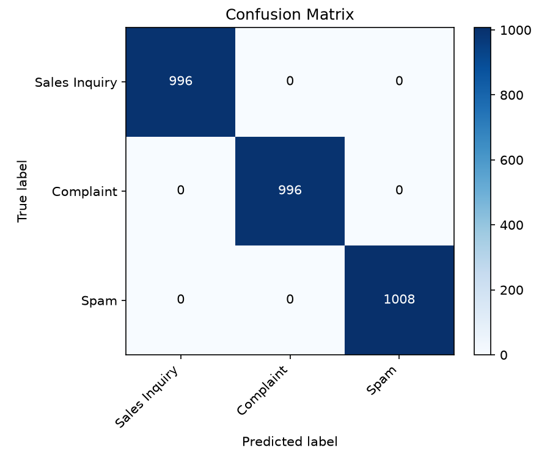
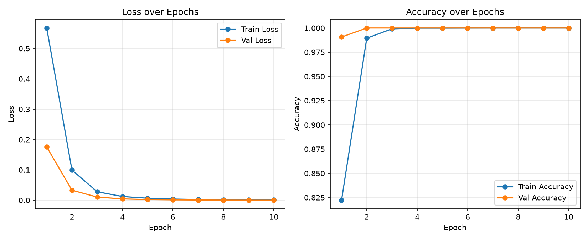

# Hibrit Derin Öğrenme ve LLM Yönlendirme Sistemi

Maliyet odaklı bir müşteri destek mesajı yönlendirme sistemi. Sıfırdan eğitilmiş,
hafif bir PyTorch metin sınıflandırıcısı, gelen her mesajı **Satış Sorgusu**,
**Şikayet** veya **Spam** olarak etiketler. Yalnızca geçerli ve spam olmayan
mesajlar, ayrıntılı bir yanıt için (simüle edilmiş) bir GPT modeline yönlendirilir;
spam mesajlar ise anında ücretsiz bir şablon yanıtla filtrelenir, böylece
gereksiz bir LLM API çağrısından tasarruf edilir.

```
Müşteri mesajı
       │
       ▼
┌─────────────────────────┐
│  PyTorch Sınıflandırıcı  │   Embedding → maskeli ortalama havuzlama → Linear
│  (sıfırdan eğitildi)     │
└─────────────────────────┘
       │
       ├── etiket == "Spam"  ───────────►  TemplateResponder (ücretsiz, anında)
       │
       └── etiket != "Spam"  ───────────►  GPTRouter (mock LLM çağrısı, ayrıntılı yanıt)
```

---

## İçindekiler

- [Proje Özeti](#proje-özeti)
- [Ham Veri Setinin Neden Ön İşlemden Geçirilmesi Gerekti](#ham-veri-setinin-neden-ön-işlemden-geçirilmesi-gerekti)
- [Proje Yapısı](#proje-yapısı)
- [Kurulum](#kurulum)
- [Nasıl Çalıştırılır](#nasıl-çalıştırılır)
- [Mimari Detaylar](#mimari-detaylar)
- [Değerlendirme Sonuçları](#değerlendirme-sonuçları)
- [Geliştirme Süreci](#geliştirme-süreci)
- [Zorlu Kısımlar](#zorlu-kısımlar)
- [Öğrenilenler](#öğrenilenler)
- [Python, AI Bileşenleri ve GitHub'ın Rolü](#python-ai-bileşenleri-ve-githubın-rolü)
- [Sınırlamalar ve Dürüst Notlar](#sınırlamalar-ve-dürüst-notlar)

---

## Proje Özeti

Bu proje, bir müşteri destek sistemi için iki aşamalı, hibrit bir mesaj
yönlendirme boru hattı (pipeline) uygulamaktadır:

1. **Aşama 1 — Sınıflandırma (PyTorch, sıfırdan).** Gelen her mesaj
   tokenize edilir ve özel olarak yazılmış bir sinir ağından
   (`Embedding → maskeli ortalama havuzlama → Dropout → Linear`) geçirilerek
   üç kategoriden birine sınıflandırılır: `Sales Inquiry` (Satış Sorgusu),
   `Complaint` (Şikayet) veya `Spam`.
2. **Aşama 2 — Yönlendirme.**
   - Mesaj **Spam** olarak sınıflandırılırsa, anında ve ücretsiz bir şablon
     yanıt alır. Hiçbir LLM çağrısı yapılmaz.
   - Mesaj **Satış Sorgusu** veya **Şikayet** ise (yani geçerli ve
     potansiyel olarak karmaşık bir mesajsa), daha ayrıntılı, kişiselleştirilmiş
     bir yanıt için **GPT tarzı bir LLM**'e yönlendirilir.

Bu projede LLM çağrısı **mock'lanmıştır** (gerçek bir OpenAI/Anthropic API
key kullanılmamıştır) — sebebi ve gerçek bir API ile nasıl değiştirilebileceği
[Mimari Detaylar](#mimari-detaylar) bölümünde açıklanmıştır.

---

## Ham Veri Setinin Neden Ön İşlemden Geçirilmesi Gerekti

Ödev brief'i, Kaggle'daki **"Customer Support Tickets (200k records)"**
veri setini belirtiyor. Veri setini incelerken, `issue_description`
kolonunun toplamda sadece **10 farklı cümle** içerdiğini ve bu 10 cümlenin
**10 `category` (kategori) değerinin hepsinde yaklaşık eşit sıklıkta**
göründüğünü fark ettim. Yani metin içeriği, kategori hakkında **gerçek bir
sinyal taşımıyor** — ham `issue_description` metni üzerinde doğrudan
eğitilen bir sınıflandırıcı, hangi mimari kullanılırsa kullanılsın sadece
gürültüden öğrenmeye çalışır ve rastgele tahmin seviyesinde kalır.

Bir metin sınıflandırıcısının gerçekten öğrenebileceği bir veri kümesi
oluşturmak için, ham veri setinin **anlamlı olan** `category` kolonunu
kullandım ve `scripts/prepare_data.py` scripti ile şu adımları uyguladım:

1. **Orijinal 10 alt-kategoriyi**, ödevin istediği 3 hedef sınıfa eşledim:
   - `Sales Inquiry` (Satış Sorgusu) ← `Refund Request`, `Payment Problem`, `Feature Request`, `Subscription Cancellation`
   - `Complaint` (Şikayet) ← `Bug Report`, `Performance Issue`, `Login Issue`, `Data Sync Issue`, `Security Concern`, `Account Suspension`
2. **Sinyalsiz `issue_description` metnini**, o satırın orijinal kategorisine
   özel, elle yazılmış bir şablon havuzundan rastgele seçilen bir cümleyle
   değiştirdim (tüm kategoriler boyunca toplam 281 benzersiz, elle yazılmış
   cümle — hem ayrıntılı hem kısa/direkt ifadeler içeriyor).
3. **Sentetik bir `Spam` sınıfı ekledim** (orijinal veri setinde bulunmuyor,
   çünkü gerçek bir destek sistemi spam'i bu tür bir bilet kaydına ulaşmadan
   önce zaten filtrelerdi) — ayrı bir şablon havuzu kullanılarak.
4. Ham 200k satırın tamamı yerine, **sınıf bazında dengeli bir alt küme**
   oluşturdum (sınıf başına 10,000 satır, toplam 30,000), %80/%10/%10
   oranında train/val/test olarak ayırdım.

Bu ön işleme adımı ve arkasındaki mantık, `scripts/prepare_data.py`
dosyasının en üstündeki docstring'de de İngilizce olarak belgelenmiştir
(kod ve şablon cümleler İngilizce tutulmuştur, çünkü orijinal Kaggle veri
seti ve örnek cümle İngilizce idi).

---

## Proje Yapısı

```
hybrid-routing-system/
├── data/
│   ├── raw/                       # orijinal Kaggle CSV (depoya eklenmedi, aşağıya bakın)
│   └── processed/
│       ├── train.csv              # 24.000 satır
│       ├── val.csv                # 3.000 satır
│       ├── test.csv               # 3.000 satır
│       └── full_balanced.csv      # 30.000 satır, bölünmeden önceki hali
├── scripts/
│   ├── prepare_data.py            # ham CSV -> etiketlenmiş, dengeli, zenginleştirilmiş veri seti
│   └── train.py                   # modeli uçtan uca eğitir, checkpoint + vocab kaydeder
├── src/
│   ├── tokenizer.py                # Vocabulary class (build/encode/decode/save/load)
│   ├── dataset.py                  # TicketDataset (PyTorch Dataset) + LabelEncoder
│   ├── model.py                    # MeanPoolingTextClassifier (nn.Module)
│   ├── trainer.py                  # Trainer class: eğitim döngüsü, checkpoint kaydetme
│   ├── evaluator.py                # Evaluator class: metrikler, confusion matrix, grafikler
│   ├── router.py                   # TemplateResponder + GPTRouter (mock LLM çağrısı)
│   ├── pipeline.py                 # RoutingPipeline: sınıflandırıcı + router'ı birleştirir
│   └── main.py                     # CLI giriş noktası: --message parametresi veya interaktif mod
├── checkpoints/
│   ├── best_model.pt              # en iyi model ağırlıkları (val accuracy'ye göre)
│   ├── vocab.json                  # kaydedilmiş kelime dağarcığı
│   └── label_encoder.json          # kaydedilmiş etiket eşlemesi
├── outputs/
│   ├── confusion_matrix.png
│   ├── evaluation_report.txt
│   └── training_history.png
├── requirements.txt
└── README.md
```

> **`data/raw/` hakkında not:** ham 200k satırlık Kaggle CSV'si (~70MB)
> depoyu hafif tutmak için bu repoya eklenmemiştir. İsterseniz
> [Kaggle'dan](https://www.kaggle.com/datasets/mirzayasirabdullah07/customer-support-tickets-dataset-200k-records)
> indirip `data/raw/customer_support_tickets_200k.csv` konumuna
> yerleştirebilirsiniz — bu, `prepare_data.py`'nin kategori isimlerini ham
> dosyayla doğrulamasını sağlar (bu doğrulama opsiyoneldir, ham dosya
> olmadan da script sorunsuz çalışır).

---

## Kurulum

**Gereksinimler:** Python 3.10+ (3.13 üzerinde test edildi), pip.

```bash
# 1. Depoyu klonlayın
git clone <repo-url>
cd hybrid-routing-system

# 2. Sanal ortam oluşturup aktive edin
python -m venv venv
# Windows:
venv\Scripts\activate
# macOS/Linux:
source venv/bin/activate

# 3. Bağımlılıkları kurun
pip install -r requirements.txt
```

**Bağımlılıklar** (`requirements.txt`):
```
torch>=2.0.0
pandas>=2.0.0
scikit-learn>=1.3.0
matplotlib>=3.7.0
```

---

## Nasıl Çalıştırılır

Tüm komutlar proje kök dizininden çalıştırılır.

### 1. Veri setini hazırlayın
```bash
python scripts/prepare_data.py --per_class 10000
```
Şablon havuzlarından (3 sınıfa eşlenmiş 280+ benzersiz cümle)
`data/processed/{train,val,test}.csv` dosyalarını üretir. `--per_class`
parametresi, son dengeli veri setinde sınıf başına kaç satır olacağını
belirler.

### 2. Modeli eğitin
```bash
python scripts/train.py
```
Kelime dağarcığını (vocabulary) oluşturur, sınıflandırıcıyı eğitir, test
setinde değerlendirir ve şu dosyaları kaydeder:
- `checkpoints/best_model.pt` — en iyi model ağırlıkları (validation accuracy'ye göre)
- `checkpoints/vocab.json`, `checkpoints/label_encoder.json` — inference için gerekli
- `outputs/confusion_matrix.png`, `outputs/evaluation_report.txt`, `outputs/training_history.png`

Kullanışlı parametreler: `--epochs`, `--batch_size`, `--embed_dim`, `--learning_rate` (detaylar için `--help`).

### 3. Kendi mesajınızı test edin
```bash
# Tek seferlik, doğrudan komutla
python src/main.py --message "Can you tell me the price of the premium plan?"

# İnteraktif mod - istediğiniz kadar mesaj yazıp deneyebilirsiniz
python src/main.py
```
Örnek interaktif oturum:
```
$ python src/main.py
Hybrid Routing System - interactive mode
Type a customer message and press Enter. Type 'exit' or 'quit' to stop.

Enter customer message: My account got suspended yesterday, can someone help?

Predicted class: Complaint
Confidence:      0.79
Source:          gpt (mock)
Response:        We're sorry your account was suspended unexpectedly. We are
                  escalating this for manual review and will respond with a
                  resolution shortly.

Enter customer message: exit
Exiting.
```
Bu, projenin gerçek son-kullanıcı giriş noktasıdır. `pipeline.py`'nin kendi
`__main__` bloğu sadece hızlı bir iç kontrol için sabit birkaç demo mesajı
çalıştırır; gerçek bir kullanıcının (veya değerlendiricinin) kendi
mesajlarını denemesi için kullanılması gereken `main.py`'dir.

### 4. Pipeline'ın yerleşik demo mesajlarını çalıştırın (opsiyonel)
```bash
python src/pipeline.py
```
Tam pipeline üzerinden 4 sabit örnek mesaj çalıştırır — hızlı bir iç test
için kullanışlıdır, ama sistemi gerçekten kullanmak için yukarıdaki
`main.py` tercih edilmelidir.

### Tek tek bileşen kontrolleri
`src/` altındaki her modül, hızlı bağımsız bir test için doğrudan da
çalıştırılabilir:
```bash
python src/tokenizer.py
python src/dataset.py
python src/model.py
python src/trainer.py
python src/evaluator.py
python src/router.py
```

---

## Mimari Detaylar

### Tokenizer ve Vocabulary (`src/tokenizer.py`)
Sıfırdan yazılmış, basit bir whitespace/regex tokenizer (küçük harfe
çevirme, noktalama işaretlerini atma). `Vocabulary` class'ı, kelime→index
eşlemesini **sadece train setinden** oluşturur (`max_vocab_size=10000`,
`min_freq=2` — sadece bir kez geçen kelimeler `<UNK>`'a eşlenir, böylece
tek seferlik kelimelere fazla uyum (overfitting) önlenir). Özel token'lar:
`<PAD>=0`, `<UNK>=1`.

### Dataset (`src/dataset.py`)
`TicketDataset`, işlenmiş bir CSV'yi `(token_ids, label_id)` tensor
çiftlerine sarar, `max_len=32`'ye pad/truncate edilir. `LabelEncoder`,
`Sales Inquiry / Complaint / Spam → 0/1/2` eşlemesini eğitim ve inference
arasında sabit ve tutarlı tutar (JSON olarak kaydedilir/yüklenir).

### Model (`src/model.py`)
`MeanPoolingTextClassifier`: `Embedding → maskeli ortalama havuzlama → Dropout → Linear`.

- **Embedding**: her kelime için sıfırdan, eğitim sırasında öğrenilen yoğun
  bir vektör temsili (önceden eğitilmiş kelime vektörü kullanılmamıştır).
- **Maskeli ortalama havuzlama**: bir cümledeki sadece *gerçek* token'ların
  embedding'lerinin ortalamasını alır (`<PAD>` pozisyonlarını göz ardı
  ederek), tek bir sabit boyutlu vektör elde edilir. Bu, LSTM/RNN yerine
  seçildi çünkü hızlı, çok az parametreli (~48k toplam) ve sınıfların kelime
  seçimiyle (kelime sırasıyla değil) ayrıştığı bu veri kümesi için iyi
  çalışıyor.
- **Linear katman**: havuzlanmış vektörü 3 sınıf logit'ine eşler.

### Trainer (`src/trainer.py`)
Standart denetimli eğitim döngüsü (Adam optimizer, cross-entropy loss).
Her epoch için train/val loss ve accuracy'yi takip eder, en iyi validation
accuracy'ye sahip checkpoint'i kaydeder (son epoch değil).

### Evaluator (`src/evaluator.py`)
scikit-learn ile accuracy, macro precision/recall/F1 ve sınıf bazlı
metrikleri hesaplar; bir confusion matrix grafiği + metin raporu kaydeder.
Ayrıca epoch bazlı loss/accuracy grafiği için `plot_training_history()`
fonksiyonunu sunar.

### Router (`src/router.py`) — "hibrit" kısım
- `TemplateResponder`: Spam olarak sınıflandırılan mesajlar için sabit,
  anında, ücretsiz bir yanıt.
- `GPTRouter`: bir mesajı GPT tarzı bir LLM'e yönlendirmeyi simüle eder.
  **Bu bir mock'tur** — `_call_llm_api()` gerçek bir API çağrısı yapmaz.
  Mesaj metnini konu anahtar kelimeleri (fiyat, iade, giriş, çökme, abonelik
  vb.) için tarar ve konuya uygun, hazır bir yanıt döndürür; hiçbir anahtar
  kelime eşleşmezse genel, sınıf bazlı bir yanıta düşer. Bu anahtar kelime
  adımı, tamamen rastgele aynı-sınıf yanıt seçiminin, örneğin bir araç
  fiyatı sorusunu abonelik planı yanıtıyla eşleştirebileceğini fark ettikten
  sonra eklendi — ikisi de "Sales Inquiry" ama birbirinden tamamen farklı
  konular (bakınız [Zorlu Kısımlar](#zorlu-kısımlar)). Metodun imzası, gerçek
  bir API çağrısının nasıl görüneceğini yansıtır ve docstring, gerçek bir
  OpenAI/Anthropic API anahtarı kullanmak için mock gövdesinin yerine hangi
  kodun geleceğini gösterir — sadece `_call_llm_api()`'nin değişmesi yeterli
  olur, kod tabanındaki başka hiçbir şeyin değişmesi gerekmez.

### CLI giriş noktası (`src/main.py`)
Sistemi gerçekten kullanmanın yolu budur. Eğitilmiş pipeline'ı bir kez
yükler, ardından `--message` ile verilen tek bir mesajı sınıflandırıp çıkar,
ya da herhangi bir mesaj yazıp tahmin edilen sınıfı, confidence değerini,
yanıt kaynağını ve üretilen yanıtı anında görebileceğiniz interaktif bir
döngü başlatır — örnekler için [Nasıl Çalıştırılır](#nasıl-çalıştırılır)
bölümüne bakın.

---

## Değerlendirme Sonuçları

Son test seti (3.000 mesaj, 3 sınıf arasında dengeli):

| Metrik | Skor |
|---|---|
| Accuracy | 1.00 |
| Macro Precision | 1.00 |
| Macro Recall | 1.00 |
| Macro F1 | 1.00 |




Bu skorun neden yüksek olduğu ve ne anlama gelip gelmediği hakkında
[Sınırlamalar ve Dürüst Notlar](#sınırlamalar-ve-dürüst-notlar) bölümüne
bakın.

---

## Geliştirme Süreci

1. Ödev brief'inden ve bağlantılı Kaggle veri setinden başlandı.
2. Ham CSV incelendi ve `issue_description` kolonunun gerçek bir sinyal
   taşımadığı keşfedildi (sadece 10 benzersiz cümle, tüm kategorilerde
   eşit dağılmış) — bu, ham metin üzerinde doğrudan eğitim yapmak yerine
   bir şablon-zenginleştirme adımı kurma kararını doğurdu.
3. Pipeline aşağıdan yukarıya inşa edildi, her bileşen birbirine bağlanmadan
   önce ayrı ayrı test edildi: tokenizer → dataset → model → trainer →
   evaluator → router → uçtan uca pipeline.
4. İlk şablon havuzu (kategori başına 18 cümle, toplam 180) test setinde
   %100 skor veren bir model eğitti, ancak şablon stilinin dışındaki
   ifadelerde başarısız oldu — örneğin, ödev brief'indeki tam örnek cümle
   ("Can you tell me the price and mileage of the 2019 model?") sadece %58
   confidence ile yanlış sınıflandırıldı.
5. Şablon havuzları kategori başına ~25-30 cümleye (toplam 281) genişletildi,
   özellikle daha kısa/direkt ifadeler eklendi ("What is the price?",
   "I cannot log in." gibi) — bu, kelime dağarcığı kapsamını artırıp tek bir
   dar cümle stiline fazla uyumu (overfitting) azaltmak içindi. Yeniden
   eğitim sonrası, aynı ödev-brief örneği %95 confidence ile doğru şekilde
   Sales Inquiry olarak sınıflandırıldı, ve eğitim sırasında hiç görülmemiş,
   elle yazılmış yeni test mesajları da tutarlı şekilde yüksek confidence
   ile doğru sınıflandırıldı.
6. Eğitim geçmişi ve confusion matrix görselleştirmeleri eklendi.
7. Pipeline'ı şablon dışı mesajlarla elle test ederken, `GPTRouter`'ın
   aynı-sınıf yanıtlar arasından rastgele seçim yaptığı ve bunun bazen
   konuyla tutarsız yanıtlar ürettiği fark edildi (örneğin bir aracın
   fiyatı ve kilometresi hakkındaki bir soru, "aboneliğinizi yükseltme"
   hakkında bir yanıt alabiliyordu — ikisi de "Sales Inquiry" ama tamamen
   farklı konular). Bu, `GPTRouter._call_llm_api()`'ye anahtar kelime
   tabanlı konu tespiti eklenerek düzeltildi; böylece mock yanıt en azından
   mesajın gerçek konusuyla uyumlu hale geldi, sadece tahmin edilen sınıfla
   değil.
8. Projenin sadece sabit demo mesajları (`pipeline.py`) içerdiği ve gerçek
   bir kullanıcının kendi mesajını yazıp sonuç görebileceği bir yolun
   olmadığı fark edildi. Hem tek seferlik `--message "..."` parametresini
   hem de tam interaktif modu destekleyen, uygun bir CLI giriş noktası olan
   `src/main.py` eklendi.
9. Bu README yazıldı.

---

## Zorlu Kısımlar

- **Ham veri seti doğrudan NLP için kullanılabilir değildi.** Bu, en
  beklenmedik engeldi — `issue_description` metni `category` etiketiyle
  hiçbir korelasyon göstermiyordu, bu da ham metin üzerinde eğitilen herhangi
  bir sınıflandırıcının model kalitesinden bağımsız olarak rastgele tahmin
  seviyesinde performans göstermesine yol açardı. Bu durum, veri setinin
  "olduğu gibi çalıştığını" varsaymak yerine şeffaf bir ön
  işleme/zenginleştirme adımı tasarlamayı ve belgelemeyi gerektirdi.
- **Yanıltıcı yüksek accuracy'den kaçınmak.** Küçük bir şablon havuzu,
  eğitim/test accuracy'sini neredeyse anında %100'e çıkardı, bu da başta
  şüpheli göründü. *Neden* böyle olduğunu (dar bir şablon havuzunun kolay
  ayrıştırılabilir bir kelime dağarcığı oluşturması) anlamak ve ardından
  modeli dağılım dışı ifadelerle (ödevin kendi örnek cümlesi dahil) bilinçli
  şekilde test etmek, sadece başlık niteliğindeki accuracy sayısını
  bildirmek yerine gerçek bir genelleme açığını bulmak (ve kısmen
  düzeltmek) için gerekliydi.
- **Padding ve pooling doğruluğu.** `model.py`'nin başlarında, `<PAD>`
  token'larının ortalama-havuzlanmış cümle vektörüne dahil edilmemesi
  önemliydi, çünkü bu, sabit uzunluklu bir batch'teki kısa cümleler için
  sinyali sessizce zayıflatırdı. Bu, basit bir `.mean(dim=1)` yerine açık
  bir maske gerektirdi.
- **LLM yönlendirme adımını dürüst tutmak.** Gerçek bir LLM API anahtarı
  kullanılmadığından, mock'un (`GPTRouter`) kod yorumlarında ve bu README'de
  açıkça mock olarak etiketlenmesi, var olmayan gerçek bir API
  entegrasyonu varmış gibi gösterilmemesi önemliydi.
- **Mock yanıtların konuyla tutarlı olması gerekiyordu.** `GPTRouter`'ın
  ilk versiyonu, aynı sınıftaki yanıt havuzundan rastgele bir yanıt
  seçiyordu, bu da bazen bir uyumsuzluğa yol açıyordu — bir araç fiyatı
  sorusu, abonelik planları hakkında bir yanıt alabiliyordu, çünkü ikisi de
  "Sales Inquiry" ama ilgisiz konular. Bunu düzeltmek, mock'un en azından
  mesajın gerçekte ne hakkında olduğuna yanıt vermesini sağlayan hafif bir
  anahtar kelime eşleştirmesi eklemeyi gerektirdi — bu hâlâ gerçek bir
  LLM'in yapacağından çok daha basit, ama en bariz tutarsız çıktıları
  ortadan kaldırıyor.

---

## Öğrenilenler

- Bir kamuya açık veri setinin etiketleri ile metni arasında gerçekte bir
  korelasyon olmadığını nasıl fark edeceğimi, ve gürültü üzerinde eğitim
  yapmak (veya sorunu gizlemek) yerine şeffaf, belgelenmiş bir çözüm nasıl
  kuracağımı öğrendim.
- **Yüksek accuracy'nin iyi genelleme ile aynı şey olmadığını** öğrendim —
  bir model, eğitim setiyle aynı dar dağılımdan gelen bir test setinde
  %100'e ulaşabilirken, gerçek dünya tarzı girdilerde başarısız olabilir.
  Bunu ortaya çıkarmanın tek yolu, sadece ayrılmış test bölümünü değil,
  gerçekten yeni, elle yazılmış cümleleri test etmekti.
- Sıfırdan pratik PyTorch temelleri: bir embedding katmanı uygulamak,
  doğru bir maskeli pooling yazmak, checkpoint'leme ile bir eğitim
  döngüsü yapılandırmak, ve scikit-learn ile değerlendirme metriklerini
  hesaplayıp kaydetmek.
- Ucuz, hızlı bir modelin, daha pahalı bir model/API'nin önünde bir kapı
  (gate) görevi gördüğü "hibrit" bir AI sisteminin nasıl yapılandırılacağını
  öğrendim — gerçek üretim LLM sistemlerinde yaygın, pratik bir maliyet
  optimizasyonu kalıbı.
- Bir ML pipeline'ının nesne yönelimli organizasyonu (`Vocabulary`,
  `Dataset`, `Trainer`, `Evaluator`, `Router`, `Pipeline` ayrı class'lar
  olarak) her bir parçayı bağımsız olarak test etmeyi, değiştirmeyi ve
  anlamayı çok daha kolay hale getiriyor — bunu, router'daki bir sorunu
  başka hiçbir dosyaya dokunmadan düzeltebildiğimde bizzat deneyimledim.

---

## Python, AI Bileşenleri ve GitHub'ın Rolü

- **Python**, tüm pipeline boyunca kullanıldı: veri ön işleme (`pandas`),
  sinir ağı ve eğitim döngüsü (`torch`), değerlendirme (`scikit-learn`) ve
  görselleştirme (`matplotlib`).
- **AI/ML bileşenleri**: sıfırdan eğitilmiş, özel bir PyTorch sinir ağı
  (embedding + maskeli ortalama havuzlama + linear sınıflandırıcı) —
  sınıflandırıcı için önceden eğitilmiş bir model veya önceden eğitilmiş
  kelime embedding'leri kullanılmamıştır. Hibrit sistemin "LLM" yarısı şu an
  mock'lanmıştır (bakınız [Sınırlamalar](#sınırlamalar-ve-dürüst-notlar)),
  ancak gerçek bir GPT/Claude API çağrısının tek bir metot değişikliğiyle
  yerine konabileceği şekilde yapılandırılmıştır.
- **GitHub**, geliştirme süreci boyunca sürüm kontrolü için kullanıldı;
  proje yukarıda gösterilen yapıya organize edildi ve mantıksal aşamalar
  halinde commit'lendi (veri hazırlığı → model bileşenleri → eğitim/
  değerlendirme → yönlendirme/pipeline → CLI giriş noktası → dokümantasyon).

---

## Sınırlamalar ve Dürüst Notlar

- **Veri seti sentetik/şablon tabanlıdır**, gerçek müşteri mesajları değildir.
  Orijinal Kaggle veri setinin metin kolonu kullanılabilir bir sinyal
  içermiyordu (bakınız
  [Ham Veri Setinin Neden Ön İşlemden Geçirilmesi Gerekti](#ham-veri-setinin-neden-ön-işlemden-geçirilmesi-gerekti)),
  bu nedenle bu projenin sınıflandırıcısı, orijinal veri setinin
  kategorilerine eşlenmiş, elle yazılmış şablon cümleler üzerinde
  eğitilmiştir. %100 test accuracy'si, gerçek dünya destek bileti
  performansını değil, bu şablon tabanlı kelime dağarcığının ne kadar
  net ayrıştırılabilir olduğunu yansıtmaktadır.
- **Genelleme iyi ama kusursuz değil.** Şablon havuzları genişletildikten
  sonra, model çok çeşitli yeni ifadeleri yüksek confidence ile doğru
  sınıflandırabiliyor (yukarıdaki Geliştirme Süreci bölümüne bakın), ancak
  eğitim şablonlarındaki kelime dağarcığından çok farklı girdilerde hâlâ
  kararsız kalabilir veya yanlış tahmin yapabilir. Üretime hazır bir sistem,
  çok daha büyük, çeşitli, ideal olarak gerçek dünyadan etiketlenmiş bir
  veri kümesine ihtiyaç duyardı.
- **GPT yönlendirme adımı mock'lanmıştır.** `GPTRouter` gerçek bir LLM
  API'sini çağırmaz. Mesajdaki anahtar kelimelere bakarak elle yazılmış bir
  havuzdan konuyla ilgili bir yanıt seçer (hiçbir anahtar kelime
  eşleşmezse genel bir sınıf bazlı yanıta düşer), simüle edilmiş bir
  gecikmeyle birlikte. Bu, gerçek bir dil anlama yeteneğinden çok daha
  basittir, ancak tamamen rastgele bir mock'un üreteceği en bariz
  tutarsızlıkları önler. Bu, bu ödev için bilinçli bir kapsam kararıydı
  (API anahtarı kullanılmadı) ve kod, gerçek bir API çağrısının
  `GPTRouter._call_llm_api()` içine, başka hiçbir dosyayı değiştirmeden
  yerleştirilebileceği şekilde yapılandırılmıştır.